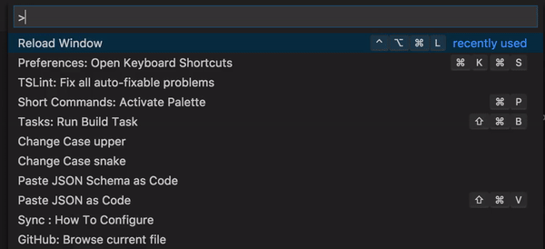

# short-commands

An alternate command palette that generates alias to commands from the first letter for command.

## Features

### Command palette with short commands

Right the now the command palette only has commands from extensions no editor commands.
The short command is the first letter of each word in the command (For example: The short command version of "Docker Compose Up" is dcu)

<!--
## Requirements

If you have any requirements or dependencies, add a section describing those and how to install and configure them.

## Extension Settings

Include if your extension adds any VS Code settings through the `contributes.configuration` extension point.

For example:

This extension contributes the following settings:

* `myExtension.enable`: enable/disable this extension
* `myExtension.thing`: set to `blah` to do something

## Known Issues

Calling out known issues can help limit users opening duplicate issues against your extension. -->

## Release Notes

### 0.0.3
Shows example commands when the palette is empty.

### 0.0.1

Adds a command palette with commands from extensions.

## Roadmap

- [ ] Add editor commands
- [ ] Add tasks
- [ ] Add custom scripts
- [ ] Add command history
- [ ] Add option to use default palette ??
- [ ] Add command